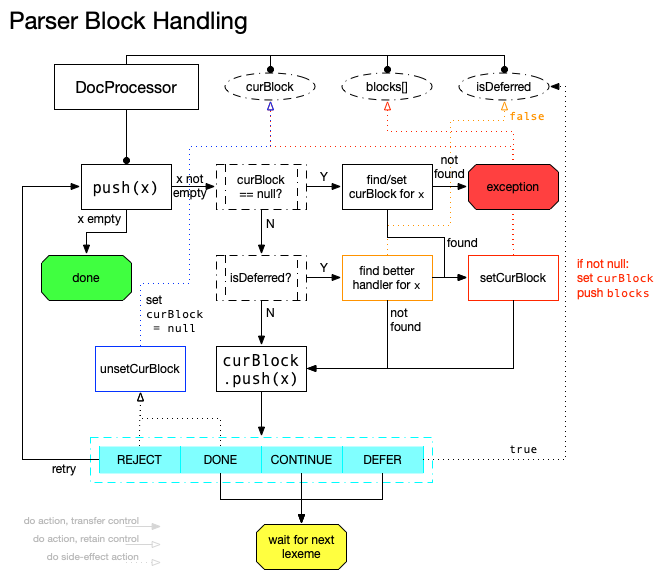

# Block Parser

A block represents a group of related text. They're defined by some sort of boundary (such as new lines or tag).

A block parser (reference implementation being `DocProcessor`) manages and communicates with different block handlers to produce the right order of blocks for a given stream of lexemes.

## Flow

- `push(x)`
    - if `curBlock == null`, find handler for `x`
        - if not found, throw **exception**
        - otherwise, set `curBlock` and push to `blocks`
    - if `isDeferred == true`, find new handler for `x`
        - set `isDeferred = false`
        - if found, set `curBlock` and push to `blocks`
        - otherwise, do nothing
    - push `x` to `curBlock` and setup next state
        - if `REJECT`, set `curBlock = null` and retry `x`
        - if `DONE`, set `curBlock = null` and wait
        - if `CONTINUE`, wait
        - if `DEFER`, set `isDeferred = true` and wait