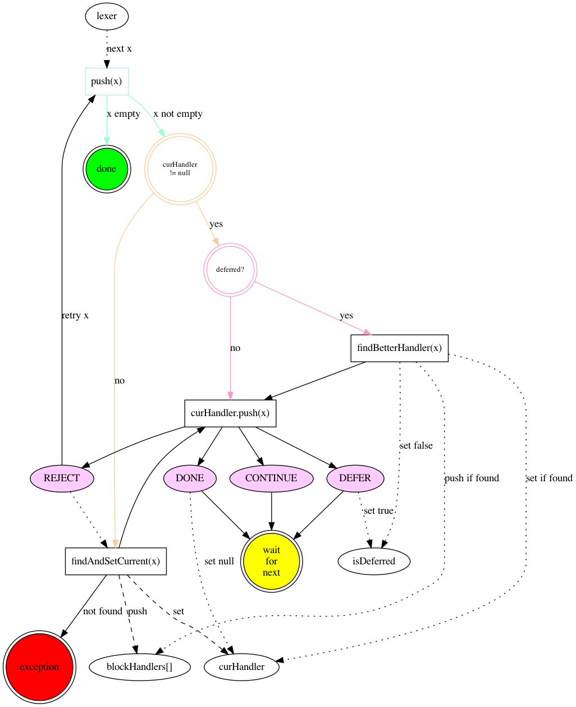

# Block ParserContext

A block represents a group of related text. They're defined by some sort of boundary (such as new lines or tag).

A block parser (reference implementation being `DocProcessor`) manages and communicates with different block handlers to produce the right order of blocks for a given stream of lexemes.

