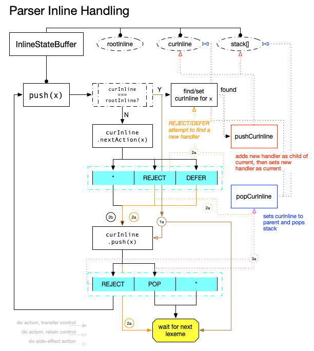
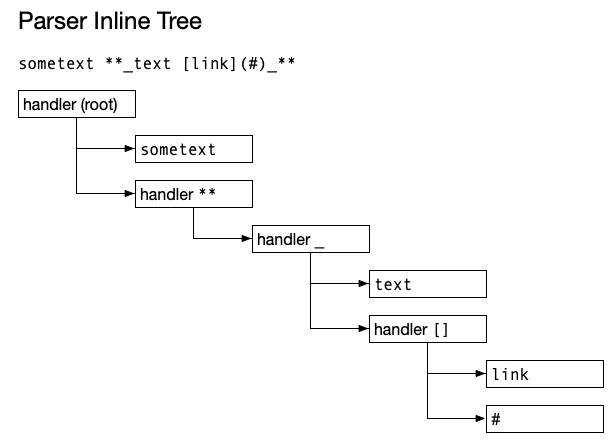

# Inline Parser

The inline parser (reference implementation being `InlineStateBuffer`) works similar to the block parser, but there are more complexities due to inline markup being nestable. For instance, in the Markdown fragment `**_text_**`, the `**` handler needs to wrap `_`, which then wraps text.

Inline handlers extend block handlers to support child handlers. The nesting described above is accomplished by:

1. maintaining a reference to the active handler
2. adding the active handler as the child of the previous handler

## Flow

To start, there's a `rootInline` handler, which directly or indirectly wraps all incoming lexemes.

- `push(x)`
    - if `curLine == rootInline`
        - find better handler for lexeme. if found:
            1. push as child of `curInline`
            2. set to `curInline`
        - `curLine.push(x)` and wait
    - otherwise, check `curInline.nextAction(x)`
        - if `REJECT`
            - set `curInline = stack.pop()`
        - if `REJECT` or `DEFER`
            - find better handler for lexeme
            - if found,
                - do `curInline.push(x)` and wait
    - check `curLine.push(x)` (essentially `CONTINUE`)
        - if `REJECT`
            - set `curInline = stack.pop()`
            - call `push(x)`
        - if `POP`
            - set `curInline = stack.pop()` and wait

After all that, a tree such as the following is produced:

## Why is `nextAction()` needed?

Using our example above, let's consider how this would work if we took a block approach to this:

- `**` matches; nest; `push(**)` returns defer
- `_` matches; nest; `push(_)` returns defer
- `text` is accepted by `_`; `push(text)` returns defer
- `_` matches; nest; `push(_)` returns defer

I'll stop there since the problem is now apparent: if a nesting handler always defers on push, the closing `_` (and `**`) will actually push those handlers again rather than popping them.

With `nextAction()`, we can have this flow:

- `**` matches; nest; `push(**)`
- `curInline.nextAction(_)` defers
- `_` matches; nest; `push(_)`
- `curInline.nextAction(text)` defers
- `text` does not match; `push(text)`
- `curInline.nextAction(_)` continues
- `push(_)` returns pop; `curInline` now goes back to `**` handler
- `curLine.nextAction(**)` continues
- `push(**)` returns pop; `curInline` now goes back to root
